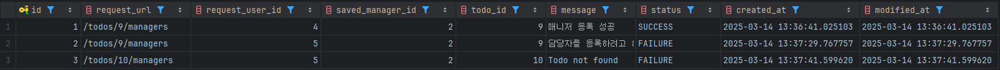
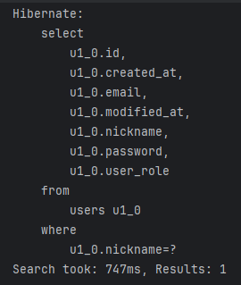
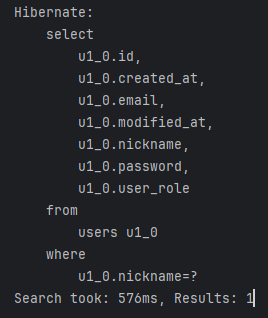
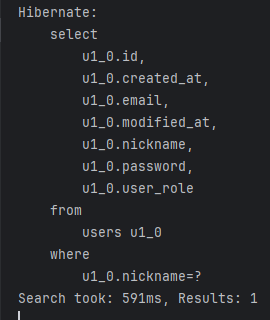
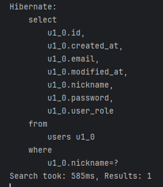
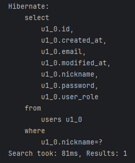
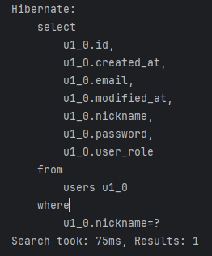
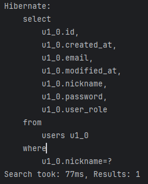
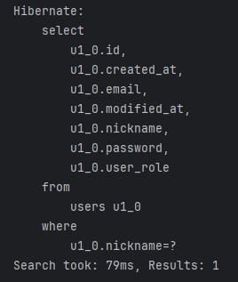

# SPRING PLUS

## 💼 목적

**[ 플러스 주차 개인 과제 ]** 의 레벨 별 요구사항 및 문제에 대하여 작성

---

## 📄 문서 기본 정보

- **작성자** : 전탁
- **작성일** : 2025.03.13 (목)
- **수정일** : 2025.03.14 (금)

---

## 1️⃣ Lv1-1요구사항 - (전탁 작성 2025.03.13)

### @Transactional의 이해

- 할 일 저장 기능을 구현한 API('/todos')를 호출할 때, 에러가 발생하고 있으므로, 수정하여야 한다.

### 해결

#### 위치 : [TodoService](src/main/java/org/example/expert/domain/todo/service/TodoService.java)

- TodoService 전체가 @Transactional(readOnly = true)로 설정되어 있어 Database와의 연결이 읽기로만 가능함.
- 따라서 saveTodos 메서드에 @Transactional을 붙여 INSERT 쿼리가 정상적으로 실행할 수 있도록 수정.

---

## 2️⃣ Lv1-2요구사항 - (전탁 작성 2025.03.13)

### JWT의 이해

- User의 정보에 nickname이 필요하므로, User 테이블에 nickname 컬럼을 추가하여야 한다.
- nickname은 중복가능하여야 한다.
- JWT에는 기존 데이터에 추가로 nickname도 들어가야 한다.

### 해결

#### 위치 : [User](src/main/java/org/example/expert/domain/user/entity/User.java), [SignupRequest](src/main/java/org/example/expert/domain/auth/dto/request/SignupRequest.java), [JwtUtil](src/main/java/org/example/expert/config/JwtUtil.java), [AuthService](src/main/java/org/example/expert/domain/auth/service/AuthService.java)

- User Entity에 nickname 컬럼을 추가함.
- SignupRequest에 nickname 컬럼을 추가하여 회원가입 시 nickname 저장할 수 있도록 수정.
- JwtUtil에서 createToken시 nickname도 토큰에 넣어 생성할 수 있도록 수정.
- AuthService에서 토큰 반환 시 nickname도 토큰에 넣어 반환할 수 있도록 수정.

---

## 3️⃣ Lv1-3요구사항 - (전탁 작성 2025.03.13)

### JPA의 이해

- 할 일 검색 시 weather 조건으로도 검색할 수 있어야 한다.
    - weather 조건은 있을 수도 있고, 없을 수도 있다.
- 할 일 검색 시 수정일 기준으로 기간 검색이 가능해야 한다.
    - 기간의 시작과 끝 조건은 있을 수도 있고, 없을 수도 있다.
- JPQL을 사용하고, 쿼리 메소드 명은 자유롭게 지정해도 된다.

### 해결

#### 위치 : [TodoController](src/main/java/org/example/expert/domain/todo/controller/TodoController.java), [TodoService](src/main/java/org/example/expert/domain/todo/service/TodoService.java), [TodoRepository](src/main/java/org/example/expert/domain/todo/repository/TodoRepository.java)

- 테스트에서 원하는 것은 400 BAD_REQUEST가 발생하는 것을 원함.
- 따라서 status().isOk()부분을 status().is4xxClientError()로 변경함.
- 또한 value값을 OK가 아닌 BAD_REQUEST로 변경함.

---

## 4️⃣ Lv1-4요구사항 - (전탁 작성 2025.03.13)

### 컨트롤러 테스트의 이해

- 테스트 패키지 org.example.expert.domain.todo.controller의 todo_단건_조회_시_todo가_존재하지_않아_예외가_발생한다() 테스트가 실패하고 있으므로, 수정하여 정상 동작하도록
  해야 한다.

### 해결

#### 위치 : [TodoControllerTest](src/test/java/org/example/expert/domain/todo/controller/TodoControllerTest.java)

- TodoController에 RequestParam으로 weather, start, end 값을 추가함.
- 해당 값들은 required = false로 입력되지 않으면 null로 처리 됨.
- TodoService의 getTodos에서 start와 end에 대한 값을 LocalDateTime으로 변환하고 todoRepository에 weather, startDay, endDay 값을 파라미터로 사용하여
  요청
- TodoRepository에서 JPQL 쿼리를 새로 생성하여 findAllByCondition이라는 이름을 통해 반환.

---

## 5️⃣ Lv1-5요구사항 - (전탁 작성 2025.03.13)

### AOP의 이해

- AOP는 UserAdminController 클래스의 changeUserRole() 메서드 실행 전 동작해야 한다.
- AdminAccessLoggingAspect 클래스에 있는 AOP를 수정하여 위 요구사항을 충족해야 한다.

### 해결

#### 위치 : [AdminAccessLoggingAspect](src/main/java/org/example/expert/aop/AdminAccessLoggingAspect.java)

- AdminAccessLoggingAspect 부분에 @After 를 @Before로 바꿔 메서드 실행전 동작할 수 있도록 수정.
- UserController의 getUser 메서드가 아닌, UserAdminController의 changeUserRole 메서드가 실행될 때 동작할 수 있도록 수정.

---

## 6️⃣ Lv2-6요구사항 - (전탁 작성 2025.03.13)

### JPA Cascade

- 할 일을 새로 저장할 시, 할 일을 생성한 유저는 담당자로 자동 등록 되어야 한다.
- JPA의 Cascade 기능을 활용해 할 일을 생성한 유저가 담당자로 등록될 수 있게 하여야 한다.

### 해결

#### 위치 : [Todo](src/main/java/org/example/expert/domain/todo/entity/Todo.java)

- managers에서 기존 @OneToMany(mappedBy = "todo") 를 @OneToMany(mappedBy = "todo", cascade = CascadeType.ALL)로 수정하여 manager까지
  함께 영속화 시키도록 수정함.

---

## 7️⃣ Lv2-7요구사항 - (전탁 작성 2025.03.13)

### N + 1

- CommentController 클래스의 getComments() API를 호출할 때 N + 1 문제가 발생하고 있으므로 수정해야 한다.

### 해결

#### 위치 : [CommentRepository](src/main/java/org/example/expert/domain/comment/repository/CommentRepository.java)

- 기존 findByTodoIdWithUser에서는 유저의 정보를 같이 가져오지 않았기 때문에, FETCH를 추가하여 유저의 정보들도 같이 가져올 수 있도록 수정함.

---

## 8️⃣ Lv2-8요구사항 - (전탁 작성 2025.03.13)

### QueryDSL

- JPQL로 작성된 findByIdWithUser(TodoService)를 QueryDSL로 변경해야 한다.
- N + 1 문제가 발생해서는 안된다.

### 해결

#### 위치 : [TodoRepositoryCustom](src/main/java/org/example/expert/domain/todo/repository/TodoRepositoryCustom.java), [TodoRepositoryCustomImpl](src/main/java/org/example/expert/domain/todo/repository/TodoRepositoryCustomImpl.java)

- QueryDSL을 사용하기 위해 gradle에 의존성을 추가.
- QueryDSL을 사용하기위 해 TodoRepositoryCustom 인터페이스 추가 생성하여 TodoRepository에 implements 함
- TodoRepositoryCustom Interface를 정의한 TodoRepositoryCustomImpl class 생성하여 findByIdWithUser 메서드 작성
- findByIdWithUser는 todoId에 맞는 할 일과 해당 유저의 값을 반환.
- 따라서 Q객체로 todo와 user를 생성한 후, queryFactory를 통해 query 생성
    - 쿼리는 다음과 같음.
        - selectFrom을 통해 todo로 부터 값을 찾겠다 선언
        - leftJoin을 통해 user 정보를 join하여 찾겠다 선언. 이때 fetchJoin을 통해 값을 가져올 수 있도록 설정
        - where문을 통해 todo.id가 todoId와 같은 todo를 찾음
        - fetchOne()을 통해 단일 객체를 가져옴.

---

## 9️⃣ Lv2-9요구사항 - (전탁 작성 2025.03.13)

### Spring Security

- 기존 Filter와 Argument Resolver를 사용하던 코드를 Spring Security로 변경해야 한다.
    - 접근 권한 및 유저 권한 기능은 그대로 유지하여야 한다.
    - 권한은 Spring Security의 기능을 사용하여야 한다.
- JWT는 그대로 사용하여야 한다.

### 해결

#### 위치 : [UserRole](src/main/java/org/example/expert/domain/user/enums/UserRole.java), [User](src/main/java/org/example/expert/domain/user/entity/User.java), [UserAdminController](src/main/java/org/example/expert/domain/user/controller/UserAdminController.java), [AuthUser](src/main/java/org/example/expert/domain/common/dto/AuthUser.java), [JWTAuthenticationToken](src/main/java/org/example/expert/config/JWTAuthenticationToken.java), [JWTAuthenticationFilter](src/main/java/org/example/expert/config/JwtAuthenticationFilter.java), [SecurityConfig](src/main/java/org/example/expert/config/SecurityConfig.java)

- 먼저 UserRole을 Spring Security에 맞게 변경해주었다.
    - 앞에 prefix로 ROLE_을 붙여 사용할 수 있도록 변경했다.
- UserAdminController는 Admin만 사용가능하여야 하기 때문에, @Secured(UserRole.Authority.ADMIN)을 사용하여 ADMIN인 유저만 접근 가능하도록 설정해준다.
- AuthUser에서는 기존 UserRole을 그대로 가져와 사용할 수 없다. Spring Security에서는 역할이 여러개 존재할 수 있다는 가정 하에 코드를 구성해 놓았기 때문에, Collection 형태로
  설정했기 때문이다. 따라서 List 형태로 userRole을 반환할 수 있도록 변경해 주었다.
- Security 보안을 통과하려면 SecurityContext에 AbstractAuthenticationToken을 set해주어야 하기 때문에,JWTAuthenticationToken을 생성하여 관리한다.
    - 해당 class에서 authUser 정보를 가지고 setAuthenticated를 해준다.
- Security의 보안을 통과하기 위하여 기존 JwtFilter에 추가로 코드를 넣었다.
    - SecurityContextHolder.getContext().setAuthentication(authenticationToken)이 없을 경우 setAuthentication해준다.
    - setAuthentication에서는 AuthUser를 생성하여 authenticationToken을 만들고, 해당 토큰을 사용하여 setAuthentication 해준다.
- 위 Spring Security에 대한 필터를 등록하기 위하여 SecurityConfig 클래스를 생성하여 Bean으로 등록해줄 수 있도록 한다.

---

## 🔟 Lv3-10요구사항 - (전탁 작성 2025.03.14)

### QueryDSL을 사용하여 검색 기능 만들기

- 새 API를 통해 만들어야 한다.
- 검색 조건은 다음을 포함해야 한다.
    - 일정의 제목으로 검색할 수 있어야 한다.
        - 일정의 제목은 부분적으로 일치해도 검색이 가능해야 한다.
    - 일정의 생성일 범위로 검색할 수 있어야 한다.
        - 생성일 최신순으로 정렬하여 반환하여야 한다.
    - 담당자의 닉네임으로도 검색이 가능하여야 한다.
        - 닉네임은 부분적으로 일치해도 검색이 가능하여야 한다.
    - 검색 결과는 다음 내용을 포함하여 반환하여야 한다.
        - 일정의 제목
        - 해당 일정의 담당자 수
        - 해당 일정의 총 댓글 개수
    - 검색 결과는 페이징 처리되어 반환되도록 하여야 한다.

### API

| HTTP 메서드 | 기능                  | URL               | 인증 필요 | 파라미터                                                        | 요청 데이터 | 응답 코드 및 설명                  | 응답 데이터                                                                       |
|----------|---------------------|-------------------|-------|-------------------------------------------------------------|--------|-----------------------------|------------------------------------------------------------------------------|
| GET      | QueryDSL을 이용한 할일 검색 | `/todos/querydsl` | YES   | Query - String : title, String createdAt, String : nickname | none   | `200 OK`, `400 Bad Request` | `Page 형태의 { "title": string, "managerCount" : long, "commentCount" : long }` |

### 해결

#### 위치 : [TodoController](src/main/java/org/example/expert/domain/todo/controller/TodoController.java), [TodoService](src/main/java/org/example/expert/domain/todo/service/TodoService.java), [TodoSearchResponse](src/main/java/org/example/expert/domain/todo/dto/response/TodoSearchResponse.java), [TodoRepositoryCustomImpl](src/main/java/org/example/expert/domain/todo/repository/TodoRepositoryCustomImpl.java)

- TodoController에 /todos/querydsl 이라는 새 API를 생성한다.
    - 해당 API에는 쿼리파라미터로 page, size, title, createdAt, nickname이 들어가고, title createdAt, nickname은 없으면 null로 처리되도록 구성하였다.
- TodoService에도 위 API에 대응되는 메서드를 생성해주었다.
    - Page형식의 TodoSearchResponse DTO 객체를 반환하는 메서드를 생성하고, todoRepository에 데이터들을 보낸 후 조건에 맞는 데이터를 응답받아 반환한다.
- TodoSearchResponse에는 todo의 id, title, 담당자 수, 댓글 수를 담을 수 있도록 구성하였다.
- TodoRepositoryCustomImpl에서 findAllUsingQueryDSL이라는 메서드를 생성해 조건에 따라 쿼리를 처리할 수 있도록 구현 하였다.
    - 조건에 따른 쿼리를 추가 위한 빌더를 생성하고, 존재하는 조건들을 빌더에 추가해준다.
    - Projections을 통해 필요한 값들만 가져올 수 있도록 구현하였다.
    - 조건에 맞는 데이터를 PageImpl을 통해 Page 형식의 객체로 반환해준다.

**추가사항**

- 이전 Spring Security에서 Controller의 메서드들에서, @Auth에 해당하는 부분을 @AuthenticationPrincipal로 바꾸지 않아 에러가 났었다.
- 따라서 이번 레벨에서 해당 부분을 수정해 정상작동 할 수 있도록 구현하였다.

---

## 1️⃣1️⃣ Lv3-11요구사항 - (전탁 작성 2025.03.14)

### Transaction 심화

- 매니저 등록 요청을 기록하는 로그 테이블을 만들어야 한다.
    - DB 테이블 명은 log로 한다.
- 매니저 등록과는 별개로 로그 테이블에는 항상 요청 로그가 남아야 한다.
    - 매니저 등록이 실패하더라도 로그는 반드시 저장되어야 한다.
    - 로그 생성 시간은 반드시 필요하다.
    - 그 외 로그에 들어가는 내용은 원하는 정보를 자유롭게 넣는다.
    - 본인이 구성한 정보
        - 로그 내용
        - 로그 요청 시각
        - 성공 실패 여부

### 해결

#### 위치 : [Log](src/main/java/org/example/expert/domain/log/entity/Log.java), [LogService](src/main/java/org/example/expert/domain/log/service/LogService.java), [ManagerService](src/main/java/org/example/expert/domain/manager/service/ManagerService.java)

- Log를 테이블에 저장하기 위하여 엔티티를 생성한다.
    - Log 엔티티에는 id, url, 요청 유저 id, 등록 대상 유저 id, 할일 id, message, 상태, 요청 시각이 존재한다.

- LogService에서 @Transactional(propagation = Propagation.REQUIRES_NEW)를 통해 매니저 등록 Transaction이 실패하더라도 등록이 될 수 있게끔 구현하였다.
- ManagerService에서 try catch 문을 통해 매니저 등록에 성공할 시 성공 상태의 로그를 저장하고, 실패시 실패 상태의 로그를 저장한다.



---

## 1️⃣2️⃣ Lv3-12요구사항 - (전탁 작성 2025.03.14)

### AWS 활용

- EC2, RDS, S3를 사용하여 프로젝트를 관리하고 배포한다.
- 각 AWS 서비스 간 보안 그룹을 적절히 구성하여 보안에 신경 써야 한다.
- **공통사항**
    - 각 AWS 서비스의 콘솔에서 내가 만든 서비스들의 설정 화면을 캡처하여 README.md에 첨부할 것
- 12-1. EC2
    - EC2 인스턴스에서 어플리케이션 실행
        - Elastic IP를 설정해 외부에서도 접속할 수 있도록 함.
        - 서버 접속 및 Live 상태를 확인할 수 있는 health check API를 만들고 README.md에 기재할 것
            - health check API는 누구나 접속 가능 해야함.
            - API path는 마음대로

- 12-2. RDS
    - RDS에 데이터베이스를 구축하고, EC2에서 실행되는 어플리케이션에 연결

- 12-3. S3
    - S3 버킷을 생성하여 유저의 프로필 이미지 업로드 및 관리 API를 구현

### API

| HTTP 메서드 | 기능                 | URL                   | 인증 필요 | 파라미터 | 요청 데이터                                 | 응답 코드 및 설명                  | 응답 데이터           |
|----------|--------------------|-----------------------|-------|------|----------------------------------------|-----------------------------|------------------|
| GET      | 서버 접속 및 Live 상태 확인 | `/health`         | NO    | none | none                                   | `200 OK`, `400 Bad Request` | `시간 + 작동 확인 메시지` |
| POST     | 유저 프로필 이미지 업로드     | `/users/image`        | YES   | none | `"imageUrl" : string, "type" : string` | `200 OK`, `400 Bad Request` | `??`             |
| DELETE   | 유저 프로필 이미지 삭제      | `/users/image/imageId` | YES   | none | none                                   | `200 OK`, `400 Bad Request` | `??`             |


### 12-1
1. EC2 인스턴스 정보


2. 보안 그룹 설정


3. 탄력적 IP 주소 설정


4. 결과 화면


### 12-2
1. RDS 생성 정보


2. RDS 연결 이후 연결 성공


3. Postman을 통한 회원가입 시도 성공


### 12-3
1. Postman을 통한 이미지 추가 성공


2. S3 업로드 성공


3. Postman을 통한 이미지 업데이트


4. S3 삭제 및 업로드 성공


5. 삭제 및 업로드 로그


---

## 1️⃣3️⃣ Lv3-13요구사항 - (전탁 작성 2025.03.14)

### 대용량 데이터 처리

- 대용량 데이터 처리 실습을 위해, 테스트 코드로 유저 데이터를 100만 건 생성할 것.
  - 데이터 생성 시 닉네임은 랜덤으로 지정
  - 가급적 동일한 닉네임이 들어가지 않게 설정
- 닉네임을 조건으로 유저 목록을 검색하는 API를 구현
  - 닉네임은 정확히 일치해야 검색이 가능함
- 여러가지 아이디어로 유저 검색 속도를 줄일 것
  - 조회 속도를 개선할 수 있는 방법을 고민하고, 방법을 구현해볼 것
  - README.md에 각 방법별 실행 결과를 비교할 수 있도록 최초 조회 속도와 개선 과정 별 조회 속도를 확인할 수 있는 표 또는 이미지 첨부

### 유저 서비스 수정

#### 위치 : [UserService](src/main/java/org/example/expert/domain/user/service/UserService.java)
- 유저 서비스에 추가로 nickname으로 검색이 가능하게 메서드를 구현함.

### 테스트 데이터 삽입

#### 위치 : [UserDataGenerationTest](src/test/java/org/example/expert/domain/user/controller/UserDataGenerationTest.java)
- 테스트 데이터를 100만건 삽입을 위 Test 코드를 통해 해주었음.

### 테스트 

#### 위치 : [UserControllerTest](src/test/java/org/example/expert/domain/user/controller/UserControllerTest.java)
- SpringBootTest를 통해 실제 호출이 몇초가 걸리는지 확인.


- Default 조회 시간




- 
평균 시간 약 **_625ms_**

- index를 사용 하고 난 후 조회 시간
```sql
CREATE INDEX idx_nickname ON users (nickname);
```





평균 시간 약 **_78ms_**

- 결과 : index를 사용함으로서, 약 **8**배 빠르게 조회를 할 수 있게 되었음.
- 느낀점 : ElasticSearch를 사용하여 비교해보면 더 좋을 것 같다. 하지만 기본적인 조회와 단순 indexing을 하고 난후의 조회 속도의 차이도 무려 8배나 나는 것을 보면서, 100만건 보다 더 많은 데이터의 경우 확실히 최적화를 잘해야겠다는 생각이 들었다. 나중에 기회가 된다면 ElasticSearch도 사용해보고 싶다.